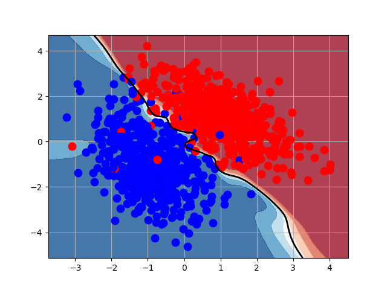
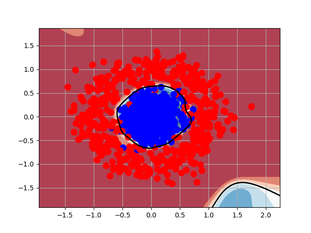
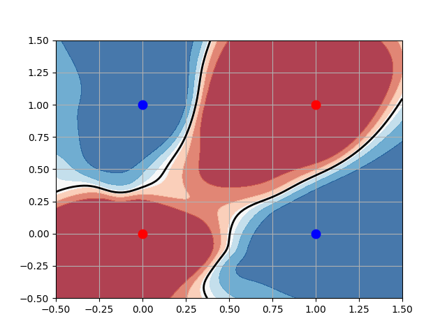

# MLP_FromScratch
Here is the development of the Multilayer Perceptron (MLP) programmed from scratch and its comparison across various classification problems

## Blobs

## Circles

## circles

## Xor

